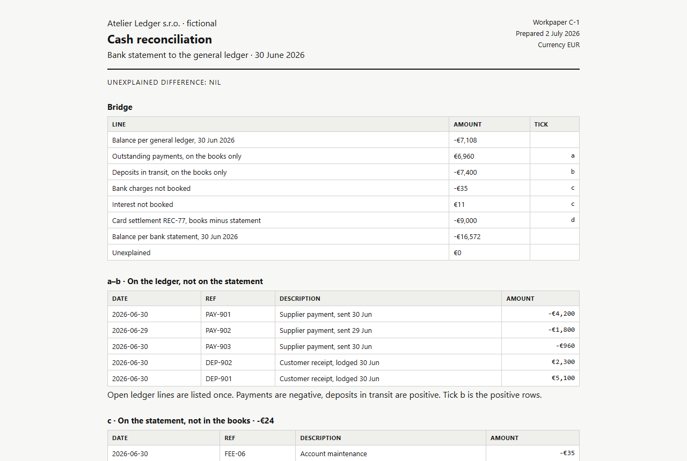

# Cash reconciliation

[](https://github.com/LiKeT128/cash-reconciliation/actions/workflows/build.yml) · **[Live workpaper →](https://liket128.github.io/cash-reconciliation/)**

A workpaper, not a dashboard and not an essay. Two lists of the same cash account, a fictional company in Bratislava, closed on 30 June 2026. The job is to show why the general ledger and the bank statement disagree, and to prove the lists are complete.

They disagree. The unexplained line is still zero.



## Run

```powershell
python build_workpaper.py
```

Open `workpaper/index.html`. Python 3.11+ and the standard library. No packages.

## How a line gets classified

The rules are views in `schema.sql`. Nothing in the tables stores the answer.

1. **Exact.** Same reference and the same amount on both sides. These lines are in both balances, so they drop out of the bridge.
2. **Date and amount.** No shared reference, same amount, statement date within two days of the ledger date. Two receipts in this book.
3. **Amount break.** Same reference, different amount. Kept separate from timing. One card settlement is €10,000 in the books and €1,000 on the statement.
4. **Open.** Whatever is left. Ledger-only lines are outstanding payments or deposits in transit. Statement-only lines are a fee and interest that were never booked.

`sql/06_bridge.sql` is the check. `unexplained` is zero only when every euro is in one of those buckets. A missing line would show up there.

## What is in the book

- 32 references that agree exactly
- 2 receipts matched on amount and date, because the statement has no reference
- 3 payments and 2 receipts still open on the ledger at 30 June
- 1 account fee and 1 interest credit on the statement only
- 1 reference, `REC-77`, booked at two different amounts

The company, the bank, and the payments are synthetic.

## What this does not do

It does not import a real bank file, and it does not post the missing fee. The workpaper stops at the tie. Booking the fee would be the next journal, not a better reconciliation.
